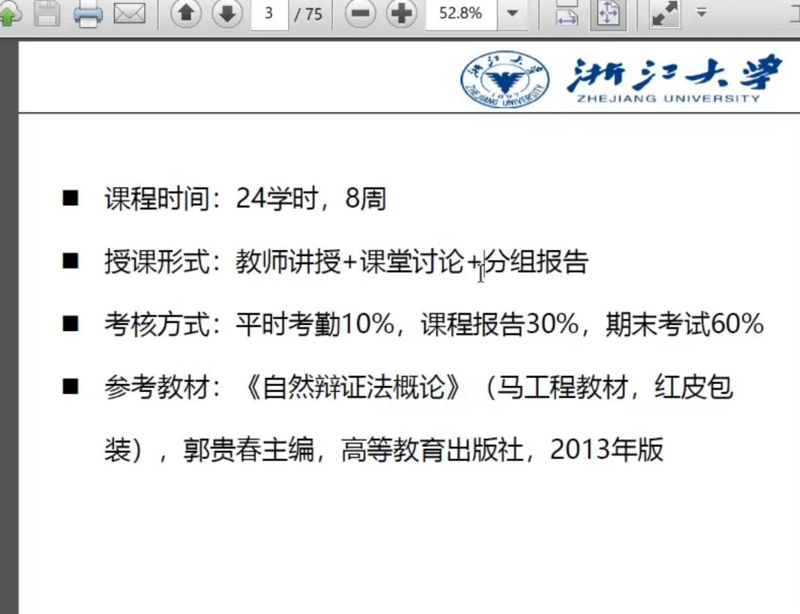
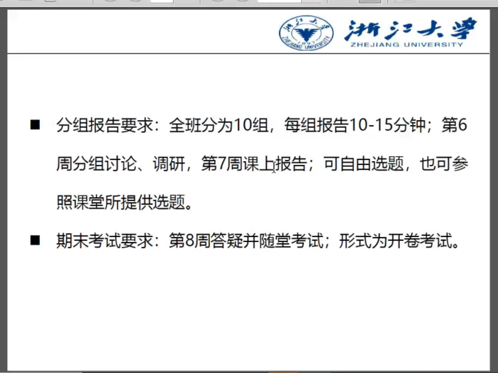

# 自然辩证法
- 徐鸿嘉 2020于杭州
## 2020/9/16
### 考核

---
### 分组报告 
- 第三周的时候老师发布分组名单
- 在第七周进行，第七周分两个直播

### 考试
- 开卷，线上，学在浙大
---
### 自然辩证法怎么来的
- 《自然辩证法》--恩格斯
  - 自然科学史
  - 自然科学与哲学
  - 辩证法
  - 物质的运动形式和科学分类；辩证唯物主义的物质观、运动观
  - 数学和各门自然科学的辩证法内容
  - 劳动在人类进化中的作用

### 自然辩证法包含什么内容

### 自然辩证法有什么用